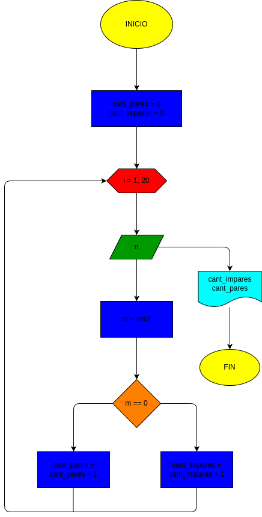
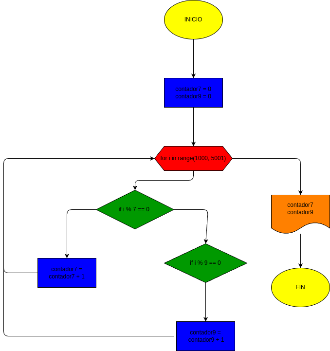

# for_1
programa de python para clacular la cantidad de números pares e impares insertados por el usuario 

## problema
- hacer el diagrama y el programa en python, que lea 20 números y que averigue de forma individual que son pares e impares 

# diagrama de flujo

GRACIAS

# problema 2
hacer el diagrama de flujo y el diagrama en python, que averigue e imprima cuantos multiplos de 7 y cuantos multiplos de 9 hay en los numeros comprendidos entre 1000 y 5000

# diagrama de flujo

